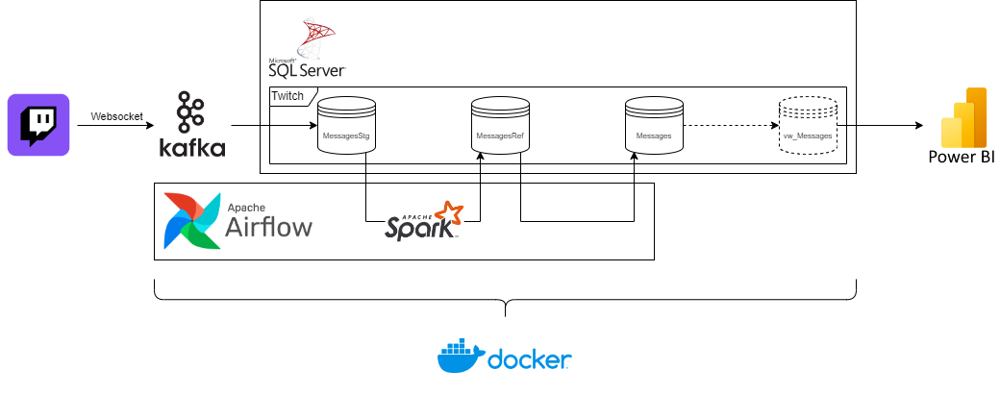

# Twitch Insight Studio 🎥

Data Engineering project to analyse my streams 💪

## Architecure



## Instructions

1. Download docker desktop.
2. Clone repository.
3. Create a .env file with the following variables in the root folder:

    - Twitch
        - TW_WEBSOCKET_TOKEN *go to [https://twitchapps.com/tmi/](https://twitchapps.com/tmi/) to obtain the token*
    - Sql Server
        - DB_SERVER='mssql'
        - DB_DATABASE='DataAnalytics'
        - DB_SA_PASSWORD
        - DB_USERNAME='KafkaConsumer'
        - DB_PASSWORD
    - Kafka
        - KK_SERVER='kafka'

4. Run docker-compose command.

    ```sh
    docker-compose up -d
    ```

5. Then, go inside airflow folder and run docker-compose command.

    ```sh
    cd airflow
    docker-compose up -d
    ```

6. Go to [airflow webserver](http://localhost:8080/).

## To do

- Connect with BI Tool
- Update README.md
- Think of which graphs we want (To know what data do we need):
  - Viewers vs/and chatters per stream (Linechart)
  - Viewers who are the most active (Barchar)
  - Subscribers vs Followers vs Just Watching (Piechart)
  - Top most used words (Barchar?)
  - Hour with more views (Barchar,Line)
  - More relevant topic (?)
